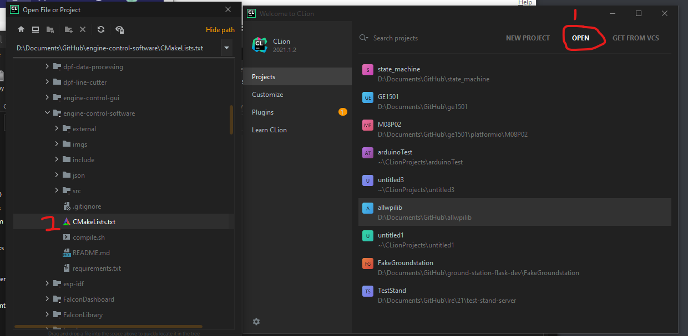
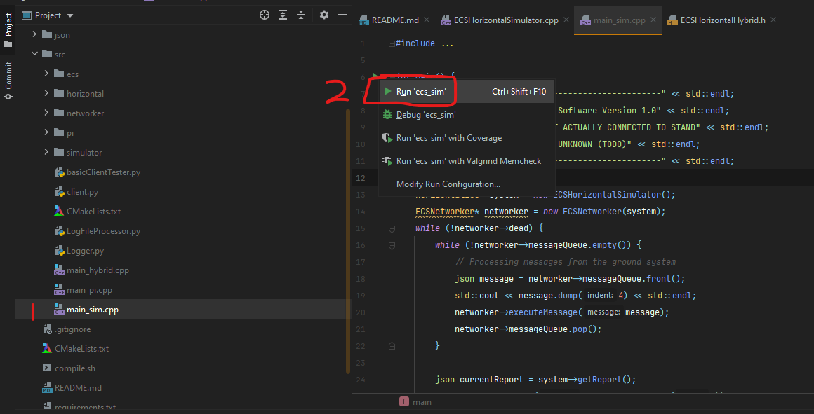

# Better Engine Control Software

ECS but better

This is a redesign of the current Engine Control System. In addition
to the before aims of safety and reliability, this redesign focuses on
better readability through object-oriented design.

Currently, we are using a RaspberryPi based electronics system to control the test stand. On the actual rocket, we will
be using a custom PCB.

#### Pulling ECS Repository
From here, your first step should be to clone the most recent version of the Engine Control Software
(ECS): 

```git clone --recurse-submodules https://gitlab.com/aeronu/dollar-per-foot/better-engine-control-software.git```

if you forgot the `--recurse-submodules` flag (aka a regular `git clone`), you need to run
```
git submodule init
git submodule sync
git submodule update
```
as well

. The current working code
should be in the `main` branch


### General System Design
TODO: Add picture of the wiring system we have here


## ----------- IGNORE THIS SECTION FOR NOW -----------
### Getting Started with RaspberryPi
To get started you'll first need a Pi, a 5V, a 2-2.5A power supply, a micro-sd card (if not already in the pi), 
and an ethernet cable.

#### Flashing the OS
If the Pi has not been set up yet, you will need to flash the OS. We are currently using the default version of 
the [RaspberryPi OS w/ Desktop](https://www.raspberrypi.org/software/operating-systems/). We may in the future 
move to the Lite version after testing the dependencies. You can use a tool like 
[balenaEtcher](https://www.balena.io/etcher/) to flash the OS image onto the SD card.

#### Connecting to the Pi
Once the operating system has been flashed, the easiest way to connect to the Pi will be over ssh. Connect 
your laptop to the Pi via ethernet and run `ssh pi@raspberrypi.local`. The default password for any new Pi 
OS is `raspberry`.

#### Pulling ECS Repository
From here, your first step should be to clone the most recent version of the Engine Control Software 
(ECS): `git clone https://gitlab.com/aeronu/dollar-per-foot/engine-control-software.git`. From here, switch to the 
appropriate branch (or use `master` if you're just testing the simulator).

#### Dependencies
Before building you'll need to install CMake: `sudo apt-get install cmake`. CMake is the build system we use for 
all of our C++ code. While it is generally bundled as part of certain operating systems or as part of IDEs, it 
is not installed by default on the Pi. Aptitude will install CMake 1.16, which is sufficient for our use case. 
Before moving on you should check the version of cmake with `cmake --version`. If you have less than 3.13, 
run `sudo apt-get update` and then `sudo apt-get upgrade` to update your packages.

In order to interface with the GPIO pins on the Pi via C++ you will also need to install the 
[WiringPi](http://wiringpi.com/download-and-install/) library. The easiest way to install this library is
via apt-get: `sudo apt-get install wiringpi`.
## ----------- END IGNORE -----------


#### Building ECS (Linux/Unix systems)
Now that you have the dependencies installed, navigate to the ECS repository you cloned and run the following command:
```
cmake -S . -B build
```
This process will create a `build`` directory that will house all of the build files and keep the clutter out of 
the main repository. CMake is responsible for creating the Makefile/Ninjafiles that will build the code.

There are three executables that can be built and used: `ecs_sim`, `ecs_pi`, and `ecs_quick`.

1. `ecs_sim` is an entirely simulated version of the control system. The simulator can be configured by modifying the simulator config (planned feature).
2. `ecs_pi` is the executable used to actively control relays and read sensors from the stand. Because of its dependencies it is likely impossible to build local, but should build fine on the pi. This is the executable that should be used in all tests.
3. `ecs_quick` is if you want to quickly build and try a test script, just don't forget to tweak the CMake file!
 
*NOT CURRENTLY IN THE REDESIGN*: `ecs_hybrid` is a mix of `ecs_sim` and `ecs_pi`. It runs two versions of the control software simultaneously and is used for actively controlling the stand while providing synthetic 
data from the simulation. This is ideal for training scenarios as it can be treated as a real test where the operator is actuating valves and reading real-looking values. Because this executable has the same 
dependencies as `ecs_pi` it will not be able to be built locally.
  - If we see a need for it, we can add it


Once you have determined which executable you would like the build, you can run the command 

`cmake --build build -t [EXECUTABLE NAME]`

where `[EXECUTABLE NAME]` is replaced with the appropriate executable name.

If you would like to build all executables at once (again, only possible on the pi itself and will take some time), you can just run 

`cmake --build build`

All executables will be placed inside the `build/` directory. Inside the build directory you should be able to find your `[executable name]` executable, it might  be buried in some folders though.

#### Cross compiling for Pi using Docker

Cross-compiling is when you build a program on one kind of computer, but make it run on another. In our case, we can
cross compile for Raspbian (the Pi os) from Ubuntu pretty easily. 

We use docker for this, because I found a Docker image (sorta like a VM) for Ubuntu that has everything set up for us already. However, note
that you can't actually run the executable on your computer, even in the Docker container. That's because Docker isn't really a 
fully fledged virtual machine. For example, if your computer's architecture differs (RPi is ARM, if your computer is x86 for instance),
Docker doesn't abstract over than, your binary will fail to run.

Here's the steps to cross-compile the `ecs_pi` executable, which you run from the root directory of this project:

You may need to follow [these Docker install instructions](https://docs.docker.com/engine/install/ubuntu/) if
`sudo apt install docker.io` doesn't work. Then, add yourself to the docker group:

```
# Probably unneeded, it makes one automatically
sudo groupadd docker
sudo usermod -aG docker $USER
# Run this, or log out and then in, to register changes
newgrp docker 
```

To actually build, use `./build_docker.sh`

To then copy to the Pi, run `./install_docker.sh`. For convienence, you can install your SSH key onto the Pi:

- If you don't yet have a id_rsa.pub in ~/.ssh, create it with `ssh-keygen`
- Install with `ssh-copy-id pi@raspberrypi.local`

This will stop the `enginecontrol` service, copy the executable into `/opt/enginecontrol/`, and start the service again for you

I then copied a bunch of toolchain file stuff from wpilib (thanks wpilib!). The script above starts a docker container, creates
the cmake makefile stuff with `cmake -B build-pi -DCMAKE_BUILD_TYPE=Release -DCMAKE_TOOLCHAIN_FILE=CMake/arm-pi-gnueabihf.toolchain.cmake`,
and then builds it.

#### Connecting a GUI to the ECS
If running the ECS locally, connect the GUI to localhost:9002

If running the ECS on the pi with a laptop connected via ethernet, connect the GUI to raspberrypi.local:9002

#### Building ECS (Windows, CLion + MSVC)

The easiest way to build on Windows is probably to use Microsoft Visual C (MSVC), which comes with Visual Studio. It's really big but the only way I've found to make it actually work on Windows. CLion deals with all the cmake/make stuff for you, and allows for debugging.

- [Download Visual Studio Commuinty](https://visualstudio.microsoft.com/downloads/), and run it
- Click 'Continue'
- We'll just want 'Desktop development with C++'.

We can now import our project into CLion. In CLion, go to "Open" -> "engine-control-software/CMakeLists.txt" -> "Ok" -> "Open as Project"


In the Open Project Wizard, add our MSVC "toolchain" with "Manage toolchains" -> + sign -> Visual Studio. Click OK and OK


Navigate to `src/main_sim.cpp`, click the green arrow next to `int main()` and click `Run`.


## Make code changes on the Pi

To edit the copy of the ECS on the Pi, run the following commands in a command prompt with the stand turned on,
and connected over Ethernet:

```
ssh pi@raspberrypi.local

cd ~/engine-control-software
nano src/main_pi.cpp

<scroll to adcboard_read_task, and change the wrappedPacket->adcX number to the correct pin per the picture below>

Ctrl+X to exit
Y to save
Enter to set file name to the default
```

If the build folder exists, change into it, build code and run executable it makes:

```
cd build
make ecs_pi
./ecs_pi
```

To make further code changes, change back one directory (`cd ..`) back to engine-control-software and follow the steps above


## Get up to speed
This project uses **CMake** for building, and **Catch2** for unit-testing.
Below are some tutorial links if you want to get a idea of how these
tools work.

### Catch2:
- **Note:** We are not using the latest version of Catch2. Newer versions
have abandoned the single-header include. As we do not
currently need sophisticated features for our tests, we use the older
single header-file due to its convenience
- [A pretty in-depth tutorial](https://mariusbancila.ro/blog/2018/03/29/writing-cpp-unit-tests-with-catch2/)
- [The official quick tutorial](https://github.com/catchorg/Catch2/blob/devel/docs/tutorial.md)
  - just ignore the "Getting Catch2" section because we are
  using the old versions

### CMake:
- [A tutorial that goes over common terms and functions](https://medium.com/@onur.dundar1/cmake-tutorial-585dd180109b)
- [A tutorial that goes a bit more in depth](https://cliutils.gitlab.io/modern-cmake/chapters/basics.html)
- [Another one](https://eliasdaler.github.io/using-cmake/)


